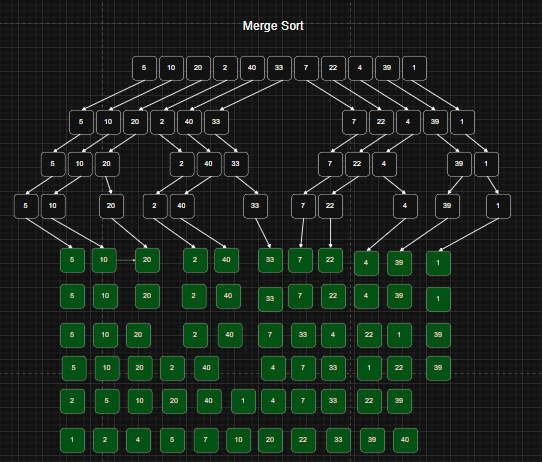

# Métodos de Ordenamiento Avanzados
## Quick Sort y Merge Sort en Java

### Información del estudiante
- Nombre: Jorge Luis Padilla
- Grupo: 3
- Profesor: Pablo Torres

---

# Introducción

En este proyecto se implementaron dos métodos de ordenamiento avanzados utilizando el lenguaje Java:

- Quick Sort
    
- Merge Sort
    
Ambos algoritmos utilizan técnicas eficientes para ordenar arreglos de números enteros.

---

# Quick Sort

## Descripción

Quick Sort es un algoritmo de ordenamiento basado en la técnica de:

- Divide y vencerás

El algoritmo selecciona un elemento llamado pivote y divide el arreglo en dos partes:

- Elementos menores al pivote
- Elementos mayores al pivote

Luego ordena cada parte de manera recursiva.

---

## Funcionamiento

### Pasos del algoritmo

1. Elegir un pivote.
2. Separar los elementos menores y mayores.
3. Ordenar recursivamente las sublistas.
4. Unir los resultados.

---

## Ejemplo


```text
Arreglo original:
5 10 20 2 40 33 7 22 4 39 1

Arreglo ordenado:
1 2 4 5 7 10 20 22 33 39 40 